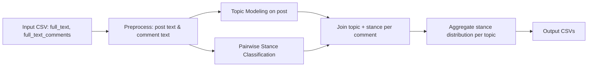

# Topic + Pairwise Stance Pipeline

## Diagram Alur Sederhana



## Penjelasan Arsitektur

- `topic` ditentukan dari `full_text` (posting utama).
- `stance` ditentukan dari hubungan pasangan `(post, comment)`.
- Hasil akhir adalah distribusi `stance` per `topic`, dan setiap komentar dipetakan ke topik postingannya.

## File Implementasi

- `topic_stance_pipeline.py`: pipeline utama
- `inference.py`: inference pairwise IndoBERT
- `topic_modeling.py`: topic modeling BERTopic
- `dataset.py`: preprocessing teks Indonesia

## Cara Menjalankan

```bash
python topic_stance_pipeline.py \
  --input-csv data/input_comments.csv \
  --output-prefix results/topic_stance \
  --stance-model-dir model_output/best_model \
  --topic-model-dir topic_model
```

Output:

- `results/topic_stance_comment_topic_stance.csv`
- `results/topic_stance_topic_stance_distribution.csv`
